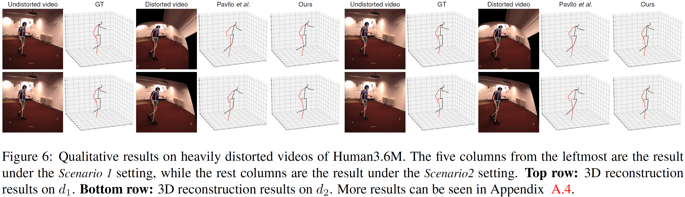

# Camera Distortion-aware 3D Human Pose Estimation in Video with Optimization-based Meta-Learning (ICCV'21)

**This is the official PyTorch implementation of the approach described in the following paper:**
> [Camera Distortion-aware 3D Human Pose Estimation in Video with Optimization-based Meta-Learning](https://arxiv.org/abs/2111.15056?context=cs)\
> [Hanbyel Cho](https://scholar.google.com/citations?user=VvNXbu8AAAAJ&hl=ko), [Yooshin Cho](https://scholar.google.com/citations?hl=ko&user=V3oL9esAAAAJ), Jaemyung Yu, and [Junmo Kim](https://scholar.google.com/citations?hl=ko&user=GdQtWNQAAAAJ)\
> IEEE/CVF International Conference on Computer Vision (ICCV), 2021

## Abstract
Existing 3D human pose estimation algorithms trained on distortion-free datasets suffer performance drop when applied to new scenarios with a specific camera distortion. In this paper, we propose a simple yet effective model for 3D human pose estimation in video that can quickly adapt to any distortion environment by utilizing MAML, a representative optimization-based meta-learning algorithm. We consider a sequence of 2D keypoints in a particular distortion as a single task of MAML. However, due to the absence of a large-scale dataset in a distorted environment, we propose an efficient method to generate synthetic distorted data from undistorted 2D keypoints. For the evaluation, we assume two practical testing situations depending on whether a motion capture sensor is available or not. In particular, we propose Inference Stage Optimization using bone-length symmetry and consistency. Extensive evaluation shows that our proposed method successfully adapts to various degrees of distortion in the testing phase and outperforms the existing state-of-the-art approaches. The proposed method is useful in practice because it does not require camera calibration and additional computations in a testing set-up.



## Dependencies
Make sure you have the following dependencies installed before proceeding:
- Python 3+ distribution
- PyTorch >= 0.4.0

## License
This work is licensed under CC BY-NC. See LICENSE for details. Third-party datasets are subject to their respective licenses.
If you use our code/models in your research, please cite our paper:
```
@InProceedings{Cho_2021_ICCV,
    author    = {Cho, Hanbyel and Cho, Yooshin and Yu, Jaemyung and Kim, Junmo},
    title     = {Camera Distortion-Aware 3D Human Pose Estimation in Video With Optimization-Based Meta-Learning},
    booktitle = {Proceedings of the IEEE/CVF International Conference on Computer Vision (ICCV)},
    month     = {October},
    year      = {2021},
    pages     = {11169-11178}
}
```

## Acknowledgement
Part of our code is borrowed from [VideoPose3D](https://github.com/facebookresearch/VideoPose3D).\
Please refer to their project page for further information.
